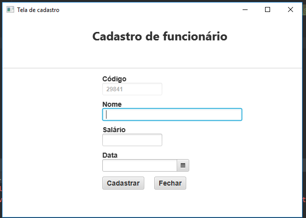
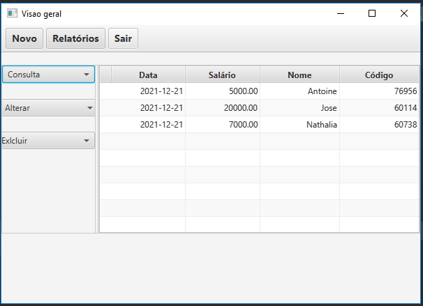

<html>

<head>
<h1>Exercícios Scadiagro</h1>
</head>

<body>
Exercícios foram resolvidos durante treinamento da Scadiagro.

<h2>
<a href="https://github.com/LoveneykensPhilogene/exercicios-Scadiagro/tree/master/src/exercicio_08">Exercicio_8</a>
<h2>

<h2>Tela de cadastro</h2>

<h2>Visão geral</h2>

</body>

</html>