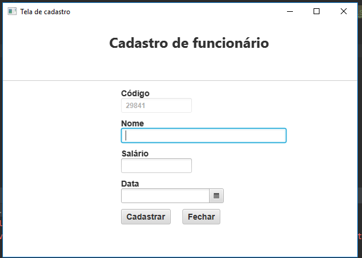
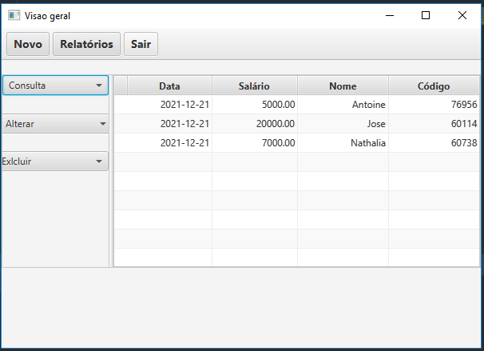

<html>
<body>
<header>
<h1>Sistema de cadastro</h1>
</header>

<strong>Tecnologias utilizadas :
<ul>
<li><a href="https://www.oracle.com/java/technologies/javase/jdk17-archive-downloads.html">Java 17</a></li>
<li><a href="https://www.oracle.com/java/technologies/install-javafx-sdk.html">JavaFX 17</a></li>
<li><a href="https://maven.apache.org/docs/3.8.1/release-notes.html">Maven 3.8.1 </a></li>
<li><a href="https://gluonhq.com/products/scene-builder/">SceneBuilder</a></li>
</ul>
</strong>

<h2>Tela de cadastro</h2>

<h2>Visão geral</h2>

</body>
<footer>
<h4>Desenvolvido por Loveneykens Philogene</h4>
&copy; Copyright 2021 Scadiagro</footer>
</html>